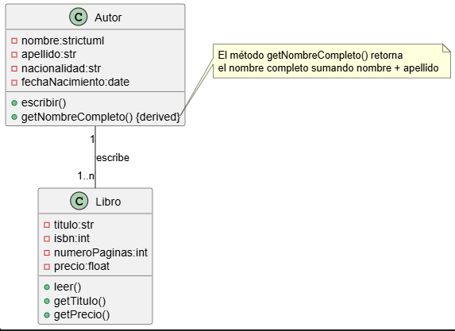
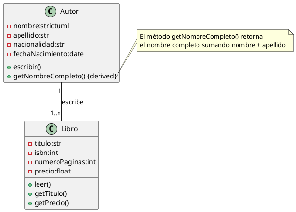

# Solución: Ejercicio 1 - Libros Autor

## Diagrama de Clases

## Código PlantUML

```plantuml
@startuml ej_1

class Autor {
    - nombre:strictuml
    - apellido:str
    - nacionalidad:str
    - fechaNacimiento:date

    + escribir()
    + getNombreCompleto() {derived}
}
class Libro {
    - titulo:str
    - isbn:int
    - numeroPaginas:int
    - precio:float

    + leer()
    + getTitulo()
    + getPrecio()
}
Autor "1" -- "1..n" Libro : escribe

note right of Autor::getNombreCompleto()
    El método getNombreCompleto() retorna
    el nombre completo sumando nombre + apellido
end note

@enduml
```