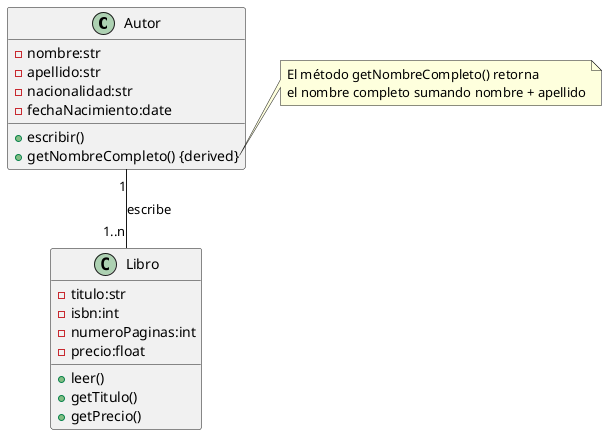

## Solución: Ejercicio - Libros Autor

## Análisis del Problema

### Identificación de Clases

1.  **Autor** 
    * Representa a la persona que escribe uno o varios libros.
    * **Atributos**: `nombre` (str), `apellido` (str), `nacionalidad` (str), `fechaNacimiento` (date).
    * **Métodos**: `escribir()`, `getNombreCompleto()` (derivada).

2.  **Libro** 
    * Representa una obra escrita por un autor.
    * **Atributos**: `titulo` (str), `isbn` (str), `numeroPaginas` (int), `precio` (float/int).
    * **Métodos**: `leer()`, `getTitulo()`, `getPrecio()`.

## Análisis de Relaciones

### 1. Agregación (Autor – Libro)
* **Nombre de la relación**: "escribe"
* **Tipo**: **Agregación** (rombo blanco en la clase **Autor**).
* **Cardinalidad**:
    * **Autor**: **1** (Cada libro es escrito por 1 solo autor).
    * **Libro**: **1..\*** (Un autor puede escribir uno o varios libros).
* **Justificación**: Indica que un **Autor** "escribe" uno o mas **Libros**. Los libros son obra del autor, pero un libro puede existir independientemente (no morir) si eliminamos al Autor del sistema (es decir, el registro del libro persiste).

## Diagrama de Clases

## Código PlantUML

## Conceptos Clave de UML Aplicados

1. **Agregación**
   - Autor tiene Libros pero no los posee completamente
   - Los libros pueden existir independientemente del autor

2. **Encapsulación**
   - Atributos privados en ambas clases (nombre, isbn, etc.)
   - Métodos públicos para interactuar con el estado

3. **Método derivado**
   - getNombreCompleto() marcado con {derived}
   - Calcula nombre + apellido dinámicamente

4. **Responsabilidad Única**
   - Autor: gestiona datos del escritor
   - Libro: gestiona datos de la obra publicada

5. **Cardinalidades**
   - 1 autor escribe 1..* libros
   - Validada en tiempo de ejecución