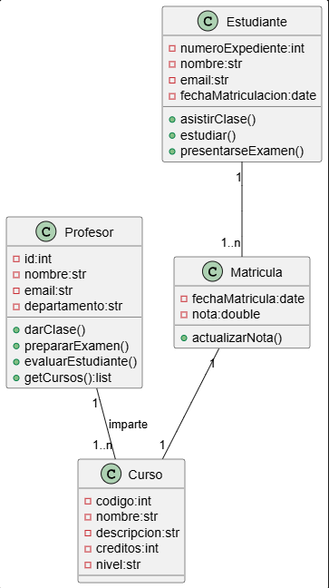
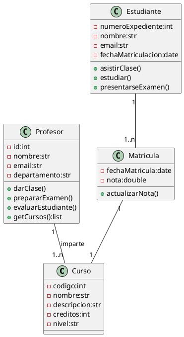

# Solución: Ejercicio 2 - Cursos Universitarios

## Diagrama de Clases

## Código PlantUML

```plantuml
@startuml ej_2
class Curso {
    - codigo:int
    - nombre:str
    - descripcion:str
    - creditos:int
    - nivel:str
}

class Profesor {
    - id:int
    - nombre:str
    - email:str
    - departamento:str

    + darClase()
    + prepararExamen()
    + evaluarEstudiante()
    + getCursos():list
}
Profesor "1" -- "1..n" Curso : "imparte"

Class Estudiante {
    - numeroExpediente:int
    - nombre:str
    - email:str
    - fechaMatriculacion:date

    + asistirClase()
    + estudiar()
    + presentarseExamen()
}

class Matricula {
    - fechaMatricula:date
    - nota:double

    + actualizarNota()
}

Estudiante "1" -- "1..n" Matricula
Matricula "1" -- "1" Curso
@enduml
```