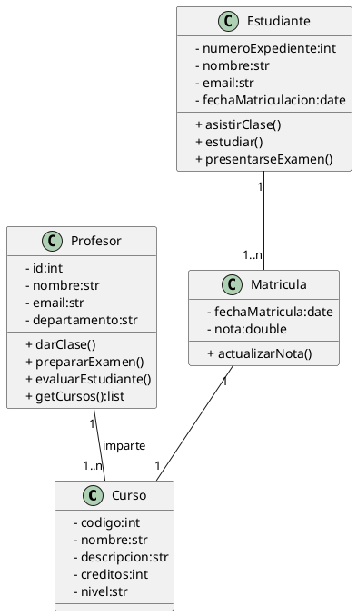

## Solución: Ejercicio - Cursos Universitarios

## Análisis del Problema

### Identificación de Clases

1.  **Curso**
    * Representa una asignatura o materia que se imparte.
    * **Atributos**: `- codigo` (int), `- nombre` (str), `- descripcion` (str), `- creditos` (int), `- nivel` (str).
    * **Métodos**: (Ninguno explícito).

2.  **Profesor**
    * Representa a la persona encargada de impartir uno o varios cursos.
    * **Atributos**: `- id` (int), `- nombre` (str), `- email` (str), `- departamento` (str).
    * **Métodos**: `+ darClase()`, `+ prepararExamen()`, `+ evaluarEstudiante()`, `+ getCursos()` (list).

3.  **Estudiante**
    * Representa a la persona que se inscribe en uno o varios cursos (a través de una Matrícula).
    * **Atributos**: `- numeroExpediente` (int), `- nombre` (str), `- email` (str), `- fechaMatriculacion` (date).
    * **Métodos**: `+ asistirClase()`, `+ estudiar()`, `+ presentarseExamen()`.

4.  **Matrícula**
    * Representa la inscripción de un **Estudiante** en un **Curso** y almacena información específica de esa relación.
    * **Atributos**: `- fechaMatricula` (date), `- nota` (double).
    * **Métodos**: `+ actualizarNota()`.

---

## Análisis de Relaciones

### 1. Profesor – Curso

* **Nombre de la relación**: "imparte"
* **Tipo**: **Asociación**
* **Cardinalidad**:
    * **Profesor**: **1**
    * **Curso**: **1..\*** * **Justificación**: Define la responsabilidad de enseñanza.

### 2. Estudiante – Matrícula

* **Nombre de la relación**: (Implícita, 'posee/registra')
* **Tipo**: **Asociación**
* **Cardinalidad**:
    * **Estudiante**: **1**
    * **Matrícula**: **1..\***
* **Justificación**: Un estudiante se matricula en cursos, y el registro es gestionado por `Matricula`.

### 3. Matrícula – Curso

* **Nombre de la relación**: (Implícita, 'registra para/pertenece a')
* **Tipo**: **Asociación**. **Matrícula** funciona como una **Clase de Asociación** entre `Estudiante` y `Curso`.
* **Cardinalidad**:
    * **Matrícula**: **1**
    * **Curso**: **1**
* **Justificación**: La clase `Matricula` vincula al `Estudiante` con el `Curso` específico y almacena la `nota`.

---

## Diagrama de Clases

## Código PlantUML

## Conceptos Clave de UML Aplicados

1. **Clase de Asociación (Patrón)**  
   - La clase Matrícula es clave, pues modela la relación M:N (muchos a muchos) entre Estudiante y Curso.  
   - Almacena atributos exclusivos de la relación (nota).

2. **Encapsulación**  
   - Todos los atributos están marcados como privados (-).  
   - Todos los métodos están marcados como públicos (+).

3. **Cardinalidades**  
   - Uso de 1..* para indicar que un Profesor o Estudiante debe tener al menos uno o más elementos de la clase asociada.

4. **Responsabilidad Única (SRP)**  
   - Profesor: gestiona las acciones de enseñanza.  
   - Estudiante: gestiona las acciones de aprendizaje.  
   - Matrícula: gestiona los datos de inscripción y rendimiento (nota).

5. **Asociaciones Bidireccionales**  
   - Las clases pueden acceder mutuamente a la información (Profesor ↔ Curso, Estudiante ↔ Matrícula).
