# Solución: Ejercicio 5 - Juego del NIM

## Análisis del Problema

### Identificación de Clases

Del análisis de las especificaciones, identificamos las siguientes clases:

1. **JuegoNIM**
   - Clase principal que coordina toda la partida
   - Atributos: palillos, jugadores, turnoActual, juegoTerminado
   - Métodos: iniciarJuego(), jugarTurno(), verificarFinJuego()

2. **Jugador**
   - Representa a un participante del juego
   - Atributos: nombre, esHumano
   - Métodos: decidirMovimiento()

3. **JugadorInteligente** (Especialización de Jugador)
   - Jugador con estrategia ganadora
   - Métodos: calcularMovimientoOptimo()

## Análisis de Relaciones

### 1. Composición (JuegoNIM - Jugador)
- **Nombre**: "tiene" / "participa en"
- **Tipo**: Agregación (no composición, porque los jugadores pueden existir independientemente)
- **Cardinalidad**: 
  - Un JuegoNIM tiene 2..* Jugadores (mínimo 2, sin máximo)
  - Un Jugador participa en 1 JuegoNIM (en este contexto)
- **Justificación**: El juego necesita múltiples jugadores para funcionar, pero los jugadores son entidades independientes

### 2. Herencia (Jugador - JugadorInteligente)
- **Tipo**: Especialización
- **Justificación**: Un JugadorInteligente "es un" Jugador con algoritmo de estrategia mejorado

## Diagrama de Clases

## Código PlantUML

```plantuml

```

## Implementación en Kotlin

(ESTRUCTURA del codigo de kotlin del diagrama, SIN LA LOGICA)

## Conceptos Clave de UML Aplicados

1. **Agregación**
   - JuegoNIM tiene Jugadores pero no los posee
   - Los jugadores pueden existir independientemente del juego

2. **Herencia**
   - JugadorInteligente especializa Jugador
   - Sobrescribe el método decidirMovimiento()

3. **Encapsulación**
   - Atributos privados (palillosRestantes, turnoActual)
   - Métodos públicos para interactuar con el estado

4. **Responsabilidad Única**
   - JuegoNIM: gestiona reglas y flujo
   - Jugador: toma decisiones de movimiento
   - JugadorInteligente: implementa estrategia

5. **Cardinalidades**
   - 2..* jugadores (mínimo 2, sin límite superior)
   - Validadas en tiempo de ejecución

## Solución: Ejercicio - Autor y Libro

## Análisis del Problema

### Identificación de Clases

Del análisis del problema, identificamos las siguientes clases:

1.  **Autor** 
    * Representa a la persona que escribe uno o varios libros.
    * **Atributos**: `nombre` (str), `apellido` (str), `nacionalidad` (str), `fechaNacimiento` (date).
    * **Métodos**: `escribir()`, `getNombreCompleto()` (derivada).

2.  **Libro** 
    * Representa una obra escrita por un autor.
    * **Atributos**: `titulo` (str), `isbn` (str), `numeroPaginas` (int), `precio` (float/int).
    * **Métodos**: `leer()`, `getTitulo()`, `getPrecio()`.

## Análisis de Relaciones

### 1. Agregación (Autor – Libro)
* **Nombre de la relación**: "escribe"
* **Tipo**: **Agregación** (rombo blanco en la clase **Autor**).
* **Cardinalidad**:
    * **Autor**: **1** (Cada libro es escrito por 1 solo autor).
    * **Libro**: **1..\*** (Un autor puede escribir uno o varios libros).
* **Justificación**: Indica que un **Autor** "escribe" uno o mas **Libros**. Los libros son obra del autor, pero un libro puede existir independientemente (no morir) si eliminamos al Autor del sistema (es decir, el registro del libro persiste).


## Diagrama de Clases

![Diagrama de clases](../assets/ej1_captura.png)

## Código PlantUML

```plantuml
@startuml ej_1

class Autor{
    - nombre:str
    - apellido:str
    - nacionalidad:str
    - fechaNacimiento:int

    + escribir()
    + getNombreCompleto() : str
}

class Libro{
    - titulo:str
    - isbn:int
    - numeroPaginas:int
    - precio:float

    + leer()
    + getTitulo() : str
    + getPrecio() : float {derived}
}

Autor "1" o-- "1..n" Libro : escribe

@enduml
```

