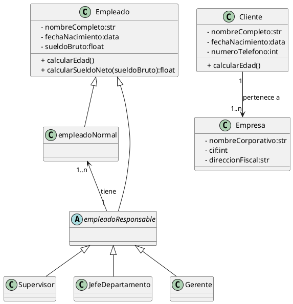

## Solución: Ejercicio - Gestión Empresarial

## Análisis del Problema

### Identificación de Clases

1.  **Curso**
    * Clase **abstracta base** que define los atributos y métodos comunes para todos los tipos de empleados.
    * **Atributos**: `- nombreCompleto` (str), `- fechaNacimiento` (data), `- sueldoBruto` (float).
    * **Métodos**: `+ calcularEdad()`, `+ calcularSueldoNeto(sueldoBruto):float`.

2.  **Cliente**
    * Representa a las entidades o individuos que se relacionan con la empresa.
    * **Atributos**: `- nombreCompleto` (str), `- fechaNacimiento` (data), `- numeroTelefono` (int).
    * **Métodos**: `+ calcularEdad()`.

3.  **Empresa**
    * Representa la entidad corporativa principal.
    * **Atributos**: `- nombreCorporativo` (str), `- cif` (int), `- direccionFiscal` (str).
    * **Métodos**: (Ninguno explícito).

4.  **empleadoResponsable**
    * Clase **abstracta** que sirve como padre para los empleados con roles de liderazgo (Supervisor, JefeDepartamento, Gerente). **Hereda** de `Empleado`.
    * **Atributos/Métodos**: (Hereda de Empleado).

5.  **empleadoNormal**
    * Clase concreta que **Hereda** directamente de `Empleado`. Representa a los empleados sin responsabilidades de supervisión.

6.  **Supervisor, JefeDepartamento, Gerente**
    * Clases concretas que **Heredan** de `empleadoResponsable`. Representan los diferentes niveles de jerarquía y responsabilidad.

---

## Análisis de Relaciones

### 1. Herencia/Generalización (Empleado)

* **Relación**: `empleadoNormal`, `empleadoResponsable` **heredan** de `Empleado`.
* **Justificación**: Permite que las clases especializadas reutilicen los atributos y métodos genéricos de `Empleado` (`sueldoBruto`, `calcularEdad()`).

### 2. Herencia/Generalización (empleadoResponsable)

* **Relación**: `Supervisor`, `JefeDepartamento`, `Gerente` **heredan** de `empleadoResponsable`.
* **Justificación**: Establece una jerarquía clara dentro de los roles de liderazgo.

### 3. Asociación (Cliente – Empresa)

* **Nombre de la relación**: "pertenece a"
* **Tipo**: **Asociación**
* **Cardinalidad**:
    * **Cliente**: **1**
    * **Empresa**: **1..\*** * **Justificación**: Relaciona a los clientes con la entidad corporativa.

### 4. Asociación (empleadoNormal – empleadoResponsable)

* **Nombre de la relación**: "tiene"
* **Tipo**: **Asociación**
* **Cardinalidad**:
    * **empleadoNormal**: **1..\***
    * **empleadoResponsable**: **1**
* **Justificación**: Modela la relación de supervisión directa.

---

## Diagrama de Clases

---

## Código PlantUML

## Conceptos Clave de UML Aplicados

1. **Agregación**  
   - JuegoNIM tiene Jugadores pero no los posee.  
   - Los jugadores pueden existir independientemente del juego.

2. **Herencia**  
   - JugadorInteligente especializa Jugador.  
   - Sobrescribe el método decidirMovimiento().

3. **Encapsulación**  
   - Atributos privados (palillosRestantes, turnoActual).  
   - Métodos públicos para interactuar con el estado.

4. **Responsabilidad Única**  
   - JuegoNIM: gestiona reglas y flujo.  
   - Jugador: toma decisiones de movimiento.  
   - JugadorInteligente: implementa estrategia.

5. **Cardinalidades**  
   - 2..* jugadores (mínimo 2, sin límite superior).  
   - Validadas en tiempo de ejecución.