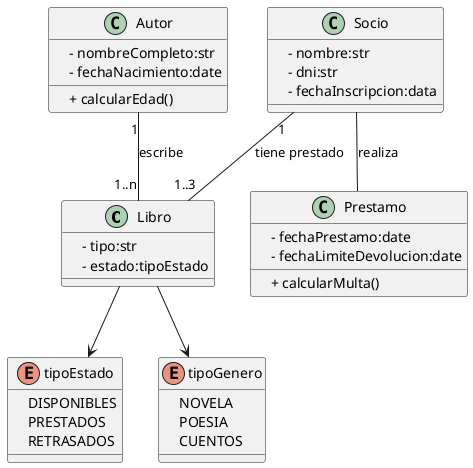

## Solución: Ejercicio - Biblioteca 

## Análisis del Problema

### Identificación de Clases y Enumeraciones

1.  **Libro**
    * Representa una obra específica dentro de la biblioteca.
    * **Atributos**: `- tipo` (str), `- estado` (tipoEstado).
    * **Métodos**: (Ninguno explícito).

2.  **Autor**
    * Representa al creador de uno o más libros.
    * **Atributos**: `- nombreCompleto` (str), `- fechaNacimiento` (date).
    * **Métodos**: `+ calcularEdad()`.

3.  **Socio**
    * Representa a la persona inscrita que puede realizar préstamos.
    * **Atributos**: `- nombre` (str), `- dni` (str), `- fechaInscripcion` (data).
    * **Métodos**: (Ninguno explícito).

4.  **Prestamo**
    * Representa el registro de la transacción de préstamo de un libro a un socio.
    * **Atributos**: `- fechaPrestamo` (date), `- fechaLimiteDevolucion` (date).
    * **Métodos**: `+ calcularMulta()`.

5.  **tipoEstado** (Enumeración)
    * Define los posibles estados de un libro (`DISPONIBLES`, `PRESTADOS`, `RETRASADOS`).

6.  **tipoGenero** (Enumeración)
    * Define las posibles clasificaciones de un libro (`NOVELA`, `POESIA`, `CUENTOS`).

---

## Análisis de Relaciones

### 1. Asociación (Autor – Libro)

* **Nombre de la relación**: "escribe"
* **Tipo**: **Asociación**
* **Cardinalidad**:
    * **Autor**: **1..\***
    * **Libro**: **1** * **Justificación**: Define la autoría de una obra.

### 2. Asociación (Socio – Libro)

* **Nombre de la relación**: "tiene prestado"
* **Tipo**: **Asociación**
* **Cardinalidad**:
    * **Socio**: **1**
    * **Libro**: **1..3** * **Justificación**: Modela el límite de libros que un socio puede tener.

### 3. Asociación (Socio – Prestamo)

* **Nombre de la relación**: "realiza"
* **Tipo**: **Asociación**
* **Cardinalidad**:
    * **Socio**: (No especificada, implícitamente **1**)
    * **Prestamo**: (No especificada, implícitamente **1..\***)
* **Justificación**: Un socio realiza uno o más préstamos a lo largo del tiempo.

### 4. Dependencia (Libro – Enumeraciones)

* **Tipo**: **Dependencia**
* **Justificación**: Los atributos del libro dependen de los valores predefinidos en `tipoEstado` y `tipoGenero`.

---

## Diagrama de Clases

---

## Código PlantUML

## Conceptos Clave de UML Aplicados

1. **Enumeraciones (Enums)**  
   - Se utiliza `enum` para definir conjuntos finitos de valores para atributos clave (`tipoEstado`, `tipoGenero`), garantizando la integridad de los datos.

2. **Cardinalidad Restringida**  
   - La asociación Socio ↔ Libro utiliza `1..3` para modelar una restricción de negocio real (un socio puede tener de uno a tres libros prestados).

3. **Asociaciones Múltiples**  
   - Socio está asociado tanto con Libro (lo tiene prestado) como con Préstamo (lo realiza), mostrando dos roles distintos.

4. **Encapsulación**  
   - Todos los atributos están marcados como privados (-).  
   - Los métodos de negocio (+ calcularEdad(), + calcularMulta()) son públicos (+).

5. **Clase de Transacción**  
   - La clase Préstamo registra la actividad temporal y almacena información relevante para la operación (fechaPrestamo, fechaLimiteDevolucion), incluyendo el comportamiento de negocio (+ calcularMulta()).

6. **Responsabilidad Única (SRP)**  
   - Libro: Gestiona datos de la obra y su estado.  
   - Autor: Gestiona datos del escritor.  
   - Préstamo: Gestiona la lógica de la operación de préstamo y sus consecuencias (multas).