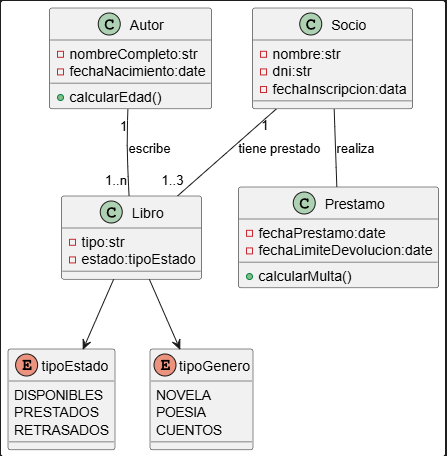
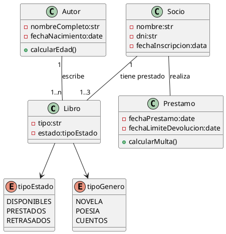

# Solución: Ejercicio 6 - Biblioteca

## Diagrama de Clases

## Código PlantUML

```plantuml
@startuml ej_6
class Libro {
    - tipo:str
    - estado:tipoEstado
}

class Autor {
    - nombreCompleto:str
    - fechaNacimiento:date
    + calcularEdad()
}

enum tipoEstado {
    DISPONIBLES
    PRESTADOS
    RETRASADOS
}
enum tipoGenero {
    NOVELA
    POESIA
    CUENTOS
}
class Socio {
    - nombre:str
    - dni:str
    - fechaInscripcion:data
}
class Prestamo {
    - fechaPrestamo:date
    - fechaLimiteDevolucion:date
    + calcularMulta()
}
Libro --> tipoEstado
Libro --> tipoGenero
Autor "1" -- "1..n" Libro : escribe
Socio "1" -- "1..3" Libro : tiene prestado
Socio -- Prestamo : realiza
@enduml
```