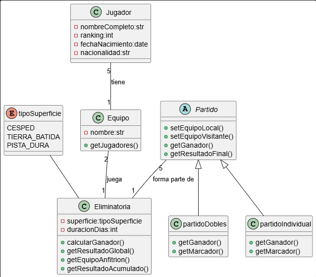
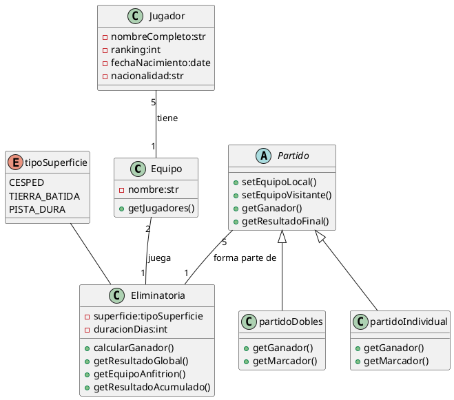

# Solución: Ejercicio 7 - Copa Davis

## Diagrama de Clases

## Código PlantUML

```plantuml
@startuml ej_7

class Equipo {
    - nombre:str
    
    + getJugadores()
}
class Jugador {
    - nombreCompleto:str
    - ranking:int
    - fechaNacimiento:date
    - nacionalidad:str
}
class Eliminatoria {
    - superficie:tipoSuperficie
    - duracionDias:int

    + calcularGanador()
    + getResultadoGlobal()
    + getEquipoAnfitrion()
    + getResultadoAcumulado()
}
enum tipoSuperficie {
    CESPED
    TIERRA_BATIDA
    PISTA_DURA
}

abstract class Partido {
    + setEquipoLocal()
    + setEquipoVisitante()
    + getGanador()
    + getResultadoFinal()
}
class partidoIndividual extends Partido {
    + getGanador()
    + getMarcador()
}
class partidoDobles extends Partido {
    + getGanador()
    + getMarcador()
}
Jugador "5" -- "1" Equipo : tiene
tipoSuperficie -- Eliminatoria
Equipo "2" -- "1" Eliminatoria : juega
Partido "5" -- "1" Eliminatoria : forma parte de
@enduml


```