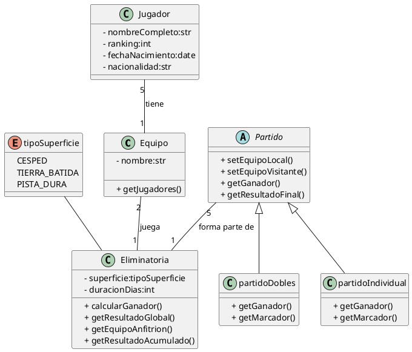

## Solución: Ejercicio - Copa Davis

## Análisis del Problema

### Identificación de Clases y Enumeraciones

1.  **Equipo**
    * Representa a un equipo nacional o grupo de jugadores que compite.
    * **Atributos**: `- nombre` (str).
    * **Métodos**: `+ getJugadores()`.

2.  **Jugador**
    * Representa a un deportista individual.
    * **Atributos**: `- nombreCompleto` (str), `- ranking` (int), `- fechaNacimiento` (date), `- nacionalidad` (str).
    * **Métodos**: (Ninguno explícito).

3.  **Eliminatoria**
    * Representa una fase de competición completa entre dos equipos (una "serie" o "ronda").
    * **Atributos**: `- superficie` (tipoSuperficie), `- duracionDias` (int).
    * **Métodos**: `+ calcularGanador()`, `+ getResultadoGlobal()`, `+ getEquipoAnfitrion()`, `+ getResultadoAcumulado()`.

4.  **Partido**
    * Clase **abstracta base** que define la estructura y comportamiento común para todos los tipos de partidos.
    * **Atributos**: (Ninguno explícito).
    * **Métodos**: `+ setEquipoLocal()`, `+ setEquipoVisitante()`, `+ getGanador()`, `+ getResultadoFinal()`.

5.  **partidoIndividual**
    * Clase concreta que **Hereda** de `Partido`.
    * **Métodos**: `+ getGanador()`, `+ getMarcador()` (sobrescribe o especializa).

6.  **partidoDobles**
    * Clase concreta que **Hereda** de `Partido`.
    * **Métodos**: `+ getGanador()`, `+ getMarcador()` (sobrescribe o especializa).

7.  **tipoSuperficie** (Enumeración)
    * Define los posibles tipos de cancha (`CESPED`, `TIERRA_BATIDA`, `PISTA_DURA`).

---

## Análisis de Relaciones

### 1. Herencia (Partido)

* **Relación**: `partidoIndividual`, `partidoDobles` **heredan** de `Partido`.
* **Justificación**: Permite que las clases específicas de partido reutilicen los métodos y la estructura comunes de `Partido`.

### 2. Composición (Equipo – Jugador)

* **Tipo**: **Asociación (Fuerte)**. Podría ser composición o agregación, pero la cardinalidad **5** en el lado del Jugador y **1** en el Equipo sugiere que el Equipo es esencialmente la colección de 5 jugadores.
* **Cardinalidad**:
    * **Jugador**: **5** (Cada equipo debe tener exactamente 5 jugadores).
    * **Equipo**: **1** (Cada jugador pertenece a 1 solo equipo).
* **Justificación**: Define la estructura y el tamaño fijo de la plantilla de un equipo.

### 3. Asociación (Eliminatoria – Equipo)

* **Nombre de la relación**: "juega"
* **Tipo**: **Asociación**
* **Cardinalidad**:
    * **Equipo**: **2** (Cada eliminatoria enfrenta exactamente a 2 equipos).
    * **Eliminatoria**: **1** (Cada equipo participa en 1 eliminatoria a la vez).
* **Justificación**: Define los dos competidores de la ronda.

### 4. Asociación (Eliminatoria – Partido)

* **Nombre de la relación**: "forma parte de"
* **Tipo**: **Asociación**
* **Cardinalidad**:
    * **Partido**: **5** (Cada eliminatoria consta de exactamente 5 partidos, típicamente 4 individuales y 1 dobles).
    * **Eliminatoria**: **1** (Cada partido pertenece a 1 sola eliminatoria).
* **Justificación**: Define los componentes de la competición (los 5 partidos que deciden la eliminatoria).

---

## Diagrama de Clases

---

## Código PlantUML

## Conceptos Clave de UML Aplicados

1. **Herencia (Generalización)**  
   - Se utiliza la relación `extends` para que `partidoIndividual` y `partidoDobles` hereden de la clase abstracta `Partido`.  
   - El método `+ getGanador()` se redefine en las subclases (polimorfismo).

2. **Cardinalidad Fija**  
   - La cardinalidad de `5` entre `Jugador` y `Equipo` (`Jugador "5" -- "1" Equipo`) establece un requisito de negocio estricto: la plantilla es exactamente de 5 jugadores.  
   - La cardinalidad `2` (`Equipo "2" -- "1" Eliminatoria`) asegura que siempre hay dos equipos compitiendo.

3. **Clases Abstractas**  
   - `Partido` está marcado como **abstracto**.  
   - No se pueden crear instancias de un `Partido` genérico, solo de sus tipos específicos (`partidoIndividual` o `partidoDobles`).

4. **Encapsulación**  
   - Todos los atributos están marcados como privados (-).  
   - Todos los métodos están marcados como públicos (+).

5. **Enumeraciones (Enums)**  
   - Se utiliza `enum (tipoSuperficie)` para limitar los valores posibles del atributo `- superficie` en la clase `Eliminatoria`.

6. **Responsabilidad Agregada**  
   - La clase `Eliminatoria` es la responsable de la lógica de alto nivel (`+ calcularGanador()`, `+ getResultadoGlobal()`), mientras que los partidos individuales (`partidoIndividual`, `partidoDobles`) gestionan la lógica de sus marcadores.