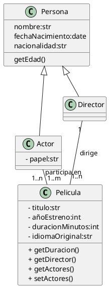

## Solución: Ejercicio - Peliculas

## Análisis del Problema

### Identificación de Clases

1.  **Pelicula**
    * Representa una obra cinematográfica.
    * **Atributos**: `- titulo` (str), `- añoEstreno` (int), `- duracionMinutos` (int), `- idiomaOriginal` (str).
    * **Métodos**: `+ getDuracion()`, `+ getDirector()`, `+ getActores()`, `+ setActores()`.

2.  **Persona**
    * Clase base que representa a un individuo. **No tiene modificadores de visibilidad** en el diagrama original.
    * **Atributos**: `nombre` (str), `fechaNacimiento` (date), `nacionalidad` (str).
    * **Métodos**: `getEdad()`.

3.  **Director**
    * Clase concreta que **Hereda** de `Persona`. Representa al director de la película.
    * **Atributos/Métodos**: (Hereda de Persona).

4.  **Actor**
    * Clase concreta que **Hereda** de `Persona`. Representa a un artista que actúa en la película.
    * **Atributos**: `- papel` (str) (atributo específico de la función de actor).
    * **Métodos**: (Hereda de Persona).

---

## Análisis de Relaciones

### 1. Herencia (Persona)

* **Relación**: `Director` y `Actor` **heredan** de `Persona`.
* **Justificación**: Permite que `Director` y `Actor` reutilicen los atributos y métodos comunes (`nombre`, `fechaNacimiento`, `getEdad()`).

### 2. Asociación (Director – Pelicula)

* **Nombre de la relación**: "dirige"
* **Tipo**: **Asociación (Uno a Muchos)**
* **Cardinalidad**:
    * **Director**: **1** (Cada película es dirigida por 1 director, según este diagrama).
    * **Pelicula**: **1..\n** (Un director puede dirigir una o varias películas).
* **Justificación**: Define el rol principal de dirección.

### 3. Asociación (Actor – Pelicula)

* **Nombre de la relación**: "participa en"
* **Tipo**: **Asociación (Muchos a Muchos)**
* **Cardinalidad**:
    * **Actor**: **1..\n** (Un actor puede participar en una o varias películas).
    * **Pelicula**: **1..\m** (Una película puede tener uno o varios actores).
* **Justificación**: Modela la relación compleja entre un reparto y múltiples obras.

---

## Diagrama de Clases

---

## Código PlantUML

## Conceptos Clave de UML Aplicados

1. **Herencia (Generalización)**  
   - Se utiliza la relación `extends` para que las clases especializadas (`Director`, `Actor`) hereden de la clase base (`Persona`).

2. **Asociación Muchos a Muchos (M:N)**  
   - La relación `Actor ↔ Pelicula (1..n - 1..m)` es un ejemplo clásico de M:N, lo que generalmente requeriría una **Clase de Asociación** (`Casting` o `Participacion`) en la implementación para almacenar el atributo `- papel:str` de manera correcta.  
   - En este diagrama, dicho atributo se adjunta directamente al `Actor`.

3. **Visibilidad No Estándar**  
   - La clase `Persona` no utiliza los modificadores de visibilidad (`+`, `-`, `#`) en sus atributos y métodos, lo que implica visibilidad por defecto (a menudo considerada `public` o `package`, dependiendo del lenguaje).

4. **Encapsulación**  
   - Aunque la clase base `Persona` tiene visibilidad por defecto, `Pelicula` y la especialización `Actor` sí usan el modificador privado (`-`) para sus atributos clave (`- titulo`, `- papel`).

5. **Responsabilidad Única (SRP)**  
   - `Persona`: Gestiona los datos biográficos.  
   - `Pelicula`: Gestiona los datos de la obra y actúa como el centro de las asociaciones.  
   - `Director` / `Actor`: Heredan y añaden roles específicos.